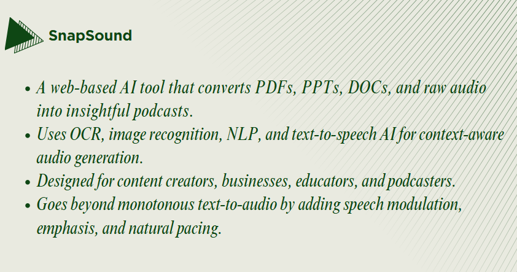
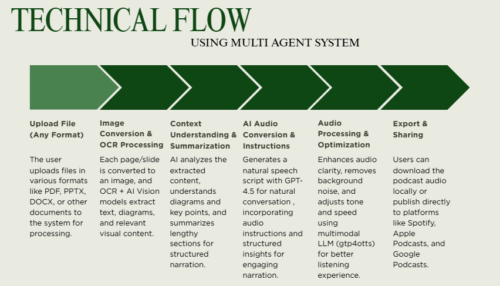
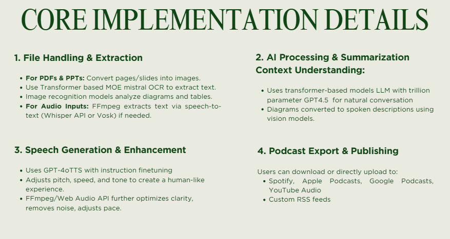
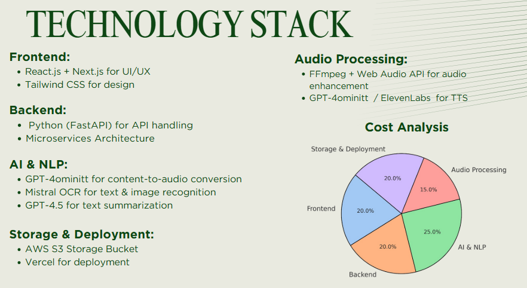
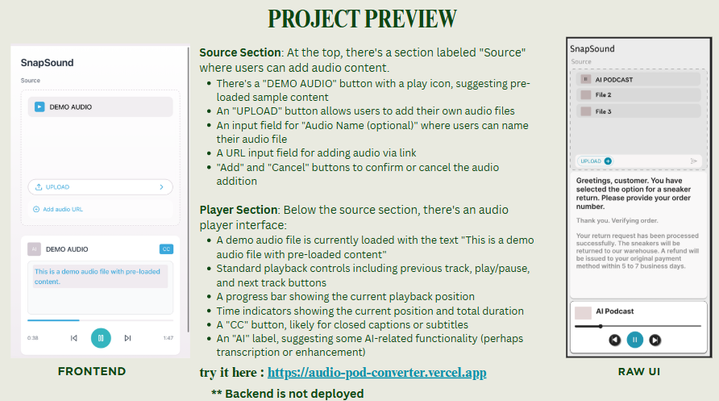

#   SnapSound - Convert Documents & Audio to Engaging Podcasts

SnapSound is a web-based AI tool that transforms your static documents (PDFs, PowerPoints, Word docs) and raw audio into engaging, context-aware podcasts using advanced AI technologies.

## 🔍 Overview

PodcastAI uses a multi-agent system combining OCR, image recognition, NLP, and advanced text-to-speech AI to create insightful podcasts from virtually any content. Our solution goes beyond simple text-to-audio conversion by adding speech modulation, emphasis, natural pacing, and contextual understanding of diagrams and visual elements.

## 🎯 Who It's For

- *Content Creators*: Convert blog posts and articles into podcasts
- *Businesses*: Transform presentations and reports into listenable content
- *Educators*: Create accessible audio versions of learning materials
- *Podcasters*: Streamline the production process with AI assistance

## ⚙ Technical Flow

Our multi-agent system processes content through these steps:

1. *Upload File* - Support for various formats (PDF, PPTX, DOCX, audio)
2. *Image Conversion & OCR Processing* - Extract text and understand visual elements
3. *Context Understanding & Summarization* - AI analyzes content for meaningful narration
4. *AI Audio Conversion & Instructions* - Generates natural speech with proper emphasis
5. *Audio Processing & Optimization* - Enhances audio quality with AI
6. *Export & Sharing* - Distribute to popular podcast platforms

   

## 💻 Core Implementation Details

### 1. File Handling & Extraction
- *Documents*: Converts pages/slides into images
- *OCR Processing*: Uses Transformer-based MOE mistral OCR
- *Visual Analysis*: Image recognition for diagrams and tables
- *Audio Inputs*: FFmpeg + Whisper API/Vosk for speech-to-text

### 2. AI Processing & Summarization
- *Context Understanding*: Trillion-parameter GPT-4.5 for natural conversation
- *Visual Elements*: Vision models convert diagrams to spoken descriptions

### 3. Speech Generation & Enhancement
- *TTS Technology*: GPT-4oTTS with instruction fine-tuning
- *Voice Modulation*: Adjusts pitch, speed, and tone for human-like experience
- *Audio Enhancement*: FFmpeg/Web Audio API for clarity and noise reduction

### 4. Podcast Export & Publishing
- *Download Options*: Local download or direct upload
- *Platform Integration*: Spotify, Apple Podcasts, Google Podcasts, YouTube Audio
- *RSS Support*: Custom RSS feeds for wider distribution

  

## 🛠 Technology Stack

### Frontend

- React.js + Next.js
- Tailwind CSS

### Backend

- Python (FastAPI)
- Microservices Architecture

### AI & NLP

- GPT-4ominitt for content-to-audio conversion
- Mistral OCR for text & image recognition
- GPT-4.5 for text summarization

### Storage & Deployment

- AWS S3 Storage Bucket
- Vercel for deployment

### Audio Processing

- FFmpeg + Web Audio API
- GPT-4ominitt / ElevenLabs for TTS

## 📱 User Interface

Our intuitive interface features:
link=>https://audio-pod-converter.vercel.app/
### Source Section
- Demo audio playback
- File upload functionality
- URL input for web-based audio
- Custom naming options

### Player Section
- Complete playback controls
- Progress tracking
- Time indicators
- Caption toggle
- AI enhancement controls

## 🚀 Getting Started

### Prerequisites
bash
# Clone the repository
git clone https://github.com/yourusername/podcast-ai.git

# Navigate to project directory
cd podcast-ai

# Install dependencies
npm install

### Configuration

1. Set up your API keys in the .env file
2. Configure storage options
3. Set up deployment preferences

### Running Locally
bash
# Start development server
npm run dev

# Build for production
npm run build

# Start production server
npm run start
